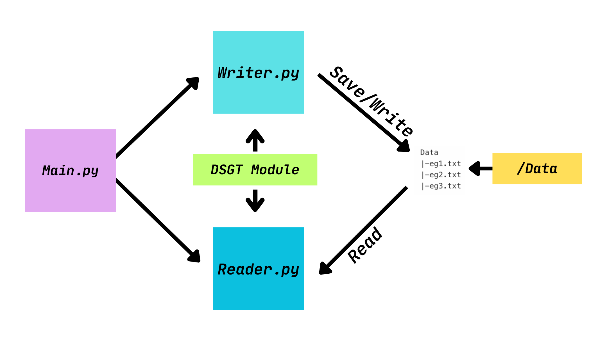

# Drone Soccer Goal Tracker 

---

## "DSGT" Module

### Data & File

#### SaveData

```python
SaveData(lap_data, path)
```

Save the ``lap_data`` to ``path.txt``.

for example: ``lap_data`` = [4.0 , 2.0 , 1.0 , 2.0] ,``path`` = ``example``

example.txt:

```
4.0
2.0
1.0
2.0
```

#### LoadData

```python
LoadData(path)
```

Read the ``path.txt``.

for example: ``path`` = "``example``"

example.txt:

```
4.0
2.0
1.0
2.0
```

The returned values: `[4.0 , 2.0 , 1.0 , 2.0]`

#### ScanFile

```
ScanFile(path)
```

Scan the File in ``path``

for example: ``path`` = Data

```
Data
|-eg1.txt
|-eg2.txt
|-eg3.txt
```

The returned values: `[eg1.txt , eg2.txt , eg3.txt]`

### User Inport Prompt

#### UserInfo

```
UserInfo()
```

Ask UserName  and `ProfileName` and combine than and return ``path`` (``UserName_ProfileName``)

CLI:

```
Enter the User Name: Peter
Enter the Profile Name: eg1
```

The returned values: "``Peter_eg1``"

#### UserPrompt

```python
UserPrompt(path)
```

Keep asking user to save the goal data.

CLI:

```
Enter lap time in seconds or type 'exit' to quit:
GOAL 1: 1 
GOAL 2: 2
GOAL 3: 5 
GOAL 4: 1
GOAL 5: 2 
GOAL 6: 3
GOAL 7: 2 
GOAL 8: exit
```

The returned values: ``[1.0, 2.0, 5.0, 1.0, 2.0, 3.0, 2.0]``

#### ExitProgram

```python
ExitProgram(path, lap_data)
```


```
Exiting Program

===== Peter_eg2.txt =====
G1: 1.0s
G2: 2.0s
G3: 3.0s
G4: 4.0s
G5: 6.0s
====================================================================================
Total Goals: 5
Average Seconds Per Goal: 3.2s(rounded to 2 decimal places)
```

#### AskPath

```python
AskPath()
```

Ask user the file name.

```
Enter the file name to load (without .txt):example
```

The returned values:  "``example``"

#### PrintFileList

```python
PrintFileList(file_list)
```

Print the file name each line  in the ``file_list``.

```
Available files in Data folder:
- Peter_eg1.txt
- Peter_eg2.txt
```

